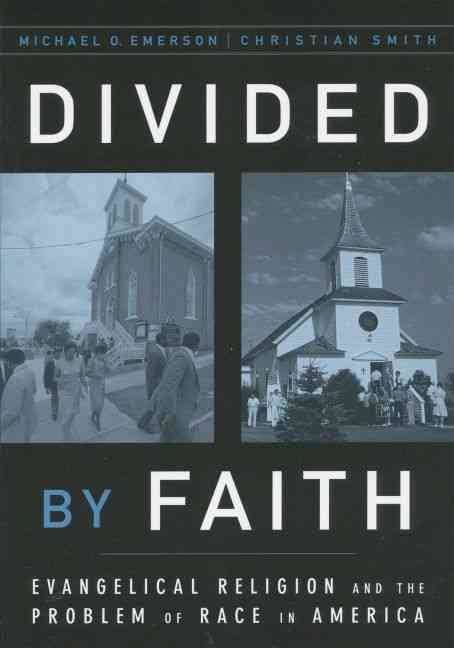

Oxford University Press, 2001  
224 Pages  
[Purchase](https://www.amazon.com/Divided-Faith-Evangelical-Religion-Problem/dp/0195147073)

## About the Authors

Michael O. Emerson is provost of North Park University in Chicago. Prior to that, he was a Professor of Sociology at Rice University in Houston, Texas.  Emerson received his PhD in sociology from the University of North Carolina, Chapel Hill.

Christian Smith is the William R. Kenan, Jr. Professor of Sociology at the University of Notre Dame. Previously he worked for University of North Carolina at Chapel Hill. Smith holds an MA and PhD in Sociology from Harvard University.

## Overview

Americans live in a  racialized society, a society where differential rewards across race are observed in nearly every facet of life. Many white evangelicals do not have a category for structural injustice, and thus tend to take a benign view of racialization, understanding it exclusively at an individualistic level. There is a well-intended notion among evangelicals that if anything can overcome racism, it is the church. However, evangelicals have a poor record of opposing racism, with deep inconsistencies documented throughout history. Today, the evangelical church is more divided than the rest of America is. In fact, structural elements of religion in America actually reinforce, rather than reduce racial division.

## Table of Contents

> 1. Confronting the Black-White Racial Divide  
2. From Separate Pews to Separate Churches  
3. Becoming Active: Contemporary Involvement in the American Dilemma  
4. Color Blind Evangelicals Speak on the "Race Problem"  
5. Controlling One's Own Destiny: Explaining Economic Inequality Between Blacks and Whites  
6. Let's Be Friends: Exploring Solutions to the Race Problem  
7. The Organization of Religion and Internally Similar Congregation  
8. Structurally Speaking: Religion and Racialization  
9. Conclusion  

## Summary

### Introduction: Religion and the Racialized Society

"This book is the story of how well-intentioned people, their values, and their institutions actually recreate racial divisions and inequalities they ostensibly oppose." There are many books on Black-White race relations and many on Protestant Evangelical Religion, but there are few that explore the intersection of these two "dynamic... and unique aspects of American life."

Who are Evangelicals? Defined theologically, they are people who hold to the authority of the scriptures, who believe that Christ is the only way to eternal salvation, and who believe in the importance of sharing the gospel. They are about 90% white. For the purposes of Smith and Emerson's survey and interview-based research, Evangelicals are those who identified themselves as such (as opposed to Mainline Christian or Catholic, for example). Another component of evangelicals is their desire to take their faith beyond the confines of the evangelical sub-culture and into the public square. Billy Graham, perhaps the best known evangelical at the time of this book, said that "racial and ethnic hostility is the foremost social problem facing our world today". This book serves as an assessment of how well evangelicals are doing.

### Chapter 1: Confronting the Black-White Racial Divide

The author's define a racialized society as "a society wherein race matters profoundly for differences in life experiences, life opportunities, and social relationships," and a society that rewards and punishes along racial lines. The authors introduce the idea of race as a social construct which can be seen when we realize that we attach social significance and meaning to certain physical characteristics (i.e., skin color) and not to others (e.g., ear size) and that social meaning and even our definitions of race have changed over time. The authors note that the concept of race arose in the sixteenth and seventeenth centuries as an ideology to justify mass enslavement of people groups. The reason that racial prejudice in society is hard to measure is that it's form changes over time. In the 1850s it could be measured with questions like "Black people are happy being slaves" whereas in the 1950s it could be measured with questions like "White people should have the right to keep black people from moving into their neighborhoods". This being said, the authors define racism as a changing ideology with "the purpose of perpetuating and justifying a social system that is racialized".

Is the US a Racialized Society? Regardless of what type of indicators you are looking at, you will see that Race is a fundamental cleavage in society. When people get married, they are not color-blind, less than one-half of one percent of marriages are black-white. There is more residential segregation between black and white than any other racial category. The unemployment ratio from black to white is 2-to-1, this has remained largely constant since 1950. Median income for blacks is 64% of what it is for whites, roughly what it was in the 1960s. One study showed that median net worth for college-educated blacks is $17k, compared to $75k for college-educated whites. The Racialized society extends to health and medicine. One study found that White Americans are much more likely to receive coronary bypass surgery than black Americans, even after controlling for income and age. For Medicare patients, this difference jumps to 4 times as likely to receive this surgery. African American babies die at 2 times the rate as white babies and African-American mothers are 4 times more likely to die in childbirth than white mothers. The Racialized society can also be seen in TV choices, the way that music is interpreted, and religion.

"Writing in the 1830s, Alexis de Tocqueville, a French aristocrat and a student of American life, noted that whites and blacks were really two foreign communities. He predicted that if and when the slaves were freed, the black-white divide would only grow more intense." This point was echoed, over 100 years later by a famous study on Race Relations in the 1930s by the Swedish Researcher Gunner Myrdal and again in 1968 by the President's Commission. Twenty-five years later, "the Eisenhower Foundation Commission concluded that the assessment of the United States as 'two societies, one black, one white—separate and unequal... [is] more relevant today"' than in 1968."

### Chapter 2: From Separate Pews to Separate Churches

Historically, Evangelical Christians in America embody deep contradictions. At times opposing various manifestations of racism, they nevertheless do not confront the racialized society as such. Cotton Mather was an early proponent for evangelizing slaves. Not surprisingly, this was unpopular with slave owners, as it was inconsistent with the prevailing idea that slaves were less than human. In response, Mather (and other clergy) went to great lengths to affirm the institution of slavery, teaching and even pushing for legislation that "Christian liberty in no way changed temporal bondage". There are records of state legislation to this effect dating back to 1664. Moving forward in time to the Great Awakening (1720-1740s), George Whitfield, the quintessential evangelical of his time, advocated for both the need of slaves to be converted to Christianity and the necessity and goodness of the institution of slavery. Indeed, in 1741, Whitfield testified before the Parliament of his home state of Georgia for the repeal of the exclusion of slavery and even owned slaves himself. These early men (and others like them) had the effect of laying the theological groundwork in the early 19th century for using the Bible to defend the practice of chattel slavery.

It was during the revolutionary period, when the contradiction between a war for freedom justified by an argument rooted in natural human rights and the institution of slavery was most apparent. It was during this time that the Bible began to be widely used to advocate for slavery. The argument went like this: since slaves are by nature inferior and unable "to control themselves, slavery allows for social order, and limits crime and vice that would otherwise occur". Later, during the Civil War period, there was some evangelical opposition to slavery but this was not widespread and where it did show up it was mainly in the north, where slavery was not prevalent. "Because the nineteenth century was dominated by evangelical Christianity—George Marsden estimates that over half of the U.S. population and 85 percent of Protestants were evangelical—it is likely that actions that occurred during this time were largely supported by evangelical Christians." The example of Charles Finney is instructive. Initially an outspoken evangelical abolitionist, speaking out against slavery from the pulpit and being the one of the first to not allow slaveholders to take communion, he did not oppose racial prejudice or segregation, and eventually abandoned the abolitionist movement all-together, seeing it as too far-reaching and a distraction from evangelism.

Moving into the civil rights era, the most famous evangelical of the 20th century, Billy Graham provided yet another example of "wavering actions on the race issue. In 1952, he held desegregated meetings in Washington, D.C.; a few weeks later in Houston, he accepted the local organizers’ segregated seating terms... he criticized segregation, but when this upset white southerners, he told the local newspaper, "I feel that I have been misinterpreted on racial segregation. We follow the existing social customs in whatever part of the country in which we minister. As far as I have been able to find in my study of the Bible, it has nothing to say about segregation or nonsegregation. I came to Jackson to preach only the Bible and not to enter into local issues."

### Chapter 3: Becoming Active: Contemporary Involvement in the American Dilemma

Starting in the late 1960s, a Theology of racial Reconciliation began being developed by Evangelical leaders in the Civil Rights movement (e.g., John Perkins, Samuel Hines, and Tom Skinner). This theology stated that contained in the very essence of the gospel message, is the power of God to reconcile us who were once enemies, to him, and, as a consequence, the power of God to reconcile us who were once enemies to each other (Ephesians 2:11-22). According to these leaders, in order to achieve true reconciliation, four things must be done.

- "First, individuals of different races must develop primary relationships with each other..."
- "The second major step demands recognizing social structures of inequality, and that all Christians must resist them together."
- Third, "whites, as the main creators and benefactors of the racialized society, must repent of their personal, historical, and social sins."  
- Fourth, African Americans "must be willing, when whites ask, to forgive them individually and corporately."

During these years a lot of progress was made, with racial reconciliation conferences being sponsored, books being co-written on the topic by black-white author combinations, church mergers between historically black and white congregations, and in 1995 the public repentance of supporting slavery of the largest protestant denomination in America, the Southern Baptist Convention. One of the biggest organizations addressing Racial Reconciliation was Promise Keepers, a Christian men's organization, headed by former University of Colorado Head Football Coach, Bill McCartney.

However, something was lost in translation. White Evangelical leaders tended to focus on the individual aspects of reconciliation such as repenting of individual racial prejudice and developing cross-racial friendships, while ignoring the part about the need for collective repentance and recognizing and resisting unjust social structures. This frustrated Black Evangelicals. Tony Evans, Megachurch pastor in Dallas, summarized: "The concerns of black Americans are not of dominant concern, by and large, to white evangelicals." Tony Warner, Black Area Leader within InterVarsity Christian Fellowship stated it directly: "White evangelicals are more willing to pursue a white conservative political agenda than to be reconciled with their African-American brothers and sisters. It raises a fundamental question of their belief and commitment to the biblical gospel." And from a white perspective, Bill McCartney reported that he received a lot of pushback from white attendees to his Promise Keeper events whenever he brought up the topic of Racial Reconciliation, even though his focus was limited to the individual component of reconciliation. What was it about the message of Racial Reconciliation that made it so difficult to hear? The focus of the next three chapters is on understanding the mindset of "grassroots evangelicals".

### Chapter 4: Color Blind Evangelicals Speak on the "Race Problem"

Getting into the core research for this book, the authors conducted over 250 face-to-face interviews with evangelicals to get their perspective on the "Race Problem." Here is a typical response from Debbie, an white evangelical woman:

> Well to me, people have problems. I mean, two white guys working together are gonna have arguments once in a while. Women are gonna have arguments. It happens between men and women, between two white guys and two white women. It’s just people. People are gonna have arguments with people. I feel like once in a while, when an argument happens, say between a black guy and a white guy, instead of saying, "Hey, there’s two guys having an argument," we say it’s a race issue (pp. 69-70).

According to Debbie, the race problem is just a individual people problem that gets exaggerated and mislabeled as being racism. This point of view was common. Among racially isolated white evangelicals, the "Race Problem" was one or more of three things: either "(1) prejudiced individuals, resulting in bad relationships and sin, (2) other groups—usually African Americans—trying to make race problems a group issue when there is nothing more than individual problems, and (3) a fabrication of the self-interested—again often African Americans, but also the media, the government, or liberals (p. 74)." These responses can be understood as an application of cultural tools that White Evangelicals use to explain and interpret life experiences:

- **Freewill Accountable Individualism:** "Individuals exist independent of structures and institutions, have freewill, and are individually accountable for their own actions" (pp. 76-77).

- **Relationalism:** Strong emphasis on interpersonal relationships rooted in "the view that human nature is fallen and that salvation and Christian maturity can only come through a 'personal relationship with Christ.' For this reason, white evangelicals... often view social problems as rooted in poor relationships or the negative influence of significant others. (pp. 77-78)."

- **Anti-Structuralism:** The belief that "invoking social structures shifts guilt away from its root source—the accountable individual" and the absence of the idea "that poor relationships might be shaped by social structures, such as laws, the ways institutions operate, or forms of segregation (pp. 78-79)."

As a part of the survey, approximately 80% of the respondents said that Racism was a very important issue to address. However, when asked to provide a concrete example of racism "a substantial number could not... Conversely, our nonwhite respondents had no trouble producing specific examples of racism, nor did the relatively racially non-isolated whites, usually both at the individual and institutional levels. As many race scholars note, not having to know the details or extent of racialization is an advantage afforded to most white Americans (p 88)." It is noteworthy that this benign view of racialization is consistent with sociological research done much earlier.

> From interviews conducted back in the late 1960s, [David T.] Wellman concluded that many white respondents believed "agitators cause racial problems; white America does not," and "America proclaims that all people are equal and there is no reason to believe otherwise. (p. 88)"

> During the late 1930s and early 1940s, Swedish scholar Gunnar Myrdal traveled America in preparation for his monumental work on American race relations. In interviewing, he found many honest, good-natured people who told him that though the United States once had a race problem back during slavery times, it no longer did. Relations between the races were good and improving all the time, people were content, and society was functioning smoothly (p. 10).

### Chapter 5: Controlling One's Own Destiny: Explaining Economic Inequality Between Blacks and Whites

The General Social Survey is a nationally representative survey that examines opinions of the American public on a range of issues. One of the questions asks why it is that "On average blacks have worse jobs, income, and housing than white people (p. 94)." A multiple-choice question, (non-exclusive) options included lack of motivation/willpower, lack of educational opportunity, and discrimination. The first would be considered an individual factor, while the second and third could be considered structural factors. The most common response given by white respondents was individual, with 51% citing lack of motivation, as compared to 42% of black respondents for a difference of 9%. The structural factors were less emphasized by white respondents, with 36% citing discrimination, compared to 63% of black respondents for a difference of 27%. Within the Conservative Protestants (defined in the survey as those believing in an afterlife, a literal, inspired Bible, and labeling themselves as evangelical or fundamentalist) these differences were larger. The most common response given by white conservative protestants was again individual, but this time 62% cited lack of motivation, as compared to 31% of black conservative respondents for a difference of 31%. The structural factors were again less emphasized by white respondents, but this time 27% cited discrimination, compared to 72% of black respondents, for a difference of 45%. On Education, there was a difference of 7% between Black and White respondents, compared to a difference of 22% between Conservative Protestant Black and White respondents. Most evangelical Christians believe that if anything has the power to achieve racial reconciliation, it is their faith. However, when it comes to explaining inequality, they are more divided than the rest of America is.

To delve deeper, the authors conducted 250 face-to-face interviews. During the interviews the researchers asked respondents an open-ended version of the same question: "Studies show that on average blacks have worse jobs, income and housing than white people... Why do you think that is?" Among white evangelical respondents there was an assumption that both black and white have equal opportunity. The authors presented the equation: *(Equally created) + (Equal opportunity) + ? = (Un-equal Outcome)*. As a a result, and in direct application of the cultural tools described earlier, the most common responses from white evangelicals were limited to individual/relational factors such as lack of vision, poor choices, breakdown of the family, and shifting the blame to structural factors like racial discrimination. The authors noted that White Christians tended to be seem uncomfortable and even angry when asked to provide their explanation for the racial differences. "What is it about inequality and black Americans that arouse such responses?... African Americans, despite their Christian association, violate key tenets of white conservative Christianity. African Americans, in their eyes, are not true accountable freewill individualists, are relationally dysfunctional, and sin both by relying on programs rather than themselves, and by shifting blame to structurally based reasons for inequality. (pp. 102-103)."

### Chapter 6: Let's Be Friends: Exploring Solutions to the Race Problem

In order to explore solutions to racism, the authors conducted their own national telephone survey with randomly selected participants (both Conservative Protestants and other). They asked if racism is a "top priority that Christians/people should be working to overcome, or not? (p. 120)" If they said yes, they then asked them which alternatives should be considered a "very important" way that we should work against racism:

> 1. Try to get to know people of another race
2. Work against discrimination in the job market and legal system
3. Work to racially integrate congregations
4. Work to racially integrate residential neighborhoods (p. 120)

Smith and Emerson classified respondents into strong Evangelicals, moderate Evangelicals, and non-Evangelicals. For 1. and 2. there were roughly equal levels of support between strong white and black Evangelicals. However, for 3. and 4. there was much higher support by strong black Evangelicals than among strong white Evangelicals. For pursuing integrated congregations 87% of strong Black evangelicals supported it, whereas only 58% of strong White evangelicals supported it. For working towards neighborhood integration, 64% of strong Black evangelicals supported it, while only 38% of strong White evangelicals did. The explanations for these disparity is consistent with the application of the cultural tools explained in chapters 4 and 5. Option 1. is individualistic, and 2. can be interpreted in an individualistic way, whereas options 3. and 4. imply some level of structural change that is required. Where there was White Evangelical support for integrated congregations, the assumption was that they should welcome black people into their churches, not that they would consider switching churches themselves.

### Chapter 7: The Organization of Religion and Internally Similar Congregation

Some Evangelicals think that it's OK that churches are segregated. Other Evangelicals think it's sad. Still others are indifferent. What no one debates, is that churches in America are segregated. "According to the 1998 National Congregations Study, about 90 percent of American congregations are made up of at least 90 percent of people of the same race."

To understand why this is the case, we need to understand the structure of religion in America. Viewed sociologically, Religion in American functions as a marketplace. There are suppliers (clergy and church staff) and customers (church attendees). Historically, the idea of multiple religious options to select from is relatively new and unique idea. In previous eras, your religion was a function of the group of people you were born into and the place you lived. There are two key factors that served to establish this form religion in America. The first factor is the enlightenment, which taught that we can as individuals use reason to discover truth for ourselves. The second factor is the first Great Awakening, which occurred in 1720-1740. These two factors culminated in the Virginia Bill for Establishing Religious Freedom (1785) and the First Amendment of the Constitution (1791) which stated "Congress shall make no law respecting an establishment of religion, or prohibiting the free exercise thereof". This officially de-established the church from the state and opened up a marketplace for religion in America. One consequence of the church marketplace, is that churches compete with other churches for church members. They develop a niche or a target demographic in order to make sure they stand out and appeal uniquely to a particular group.

Why do congregations tend to be internally similar? In order to answer this question we need to answer first, why do people join religious groups in the first place? Viewed sociologically, people want to have a shared sense of identity, belonging, and security. In order to have a social solidarity with other members of the group, boundaries must exist to define who you are (and are not) in solidarity with. Internally similar congregations provide the benefit of belonging and meaning with the least cost in terms of the least complexity and effort to run and least potential for conflict. Psychologically, people like to spend time with people like themselves. In America's racialized society, race is widely associated with other socio-demographic attributes such as income, educational attainment, health, etc... Also, people have a bias for maintaining the status quo - since the church has been segregated historically, it is just easier to maintain that than try to overcome it. (This is a similar idea to loss aversion.) Macro-sociologically, churches tend to focus on the niche that they are seeking to attract. People are less likely to feel a sense of belonging if they are on the fringe of that particular churches niche. When the people feel as though their needs are not being met, they simply change churches, to a place where they are part of the core niche. When there is overlap between niches among multiple churches (as will be the case in many mixed-race churches), this generates a situation of competition. Inevitably, the church that places a greater focus on that niche often times will win out. Race, although a sociological invention, nevertheless has meaning in terms of cultural differences. Thus, regardless of whether or not they have personal prejudice towards people of a different race, most people choose to go to church in a racially homogenous setting.

### Chapter 8: Structurally Speaking: Religion and Racialization

How does Religion in America contribute to the racialized society? First, the authors examine the role of racially homogeneous ingroup. The authors highlight five biases associated with the ingroup.

1. "people tend to exaggerate the similarities of ingroup members and their differences from outgroup members"
2. "outgroup members are identified by these differences, overly homogenizing them. This occurs even when the "difference" is merely temporary, arbitrary, and minimal, or even when the only basis for separate groups is random assignment."
3. "Even when performing exactly the same actions, ingroup members are evaluated more positively and outgroup members more negatively."
3. "we attribute positive behavior of ingroup members to internal traits such as intelligence, and negative behavior to external causes such as a poor home life. Conversely, we tend to attribute the positive behavior of outgroups to external causes such as luck, and negative behavior to internal traits such as limited intelligence."
4. people have "better memories for negative outgroup behaviors than for negative ingroup behaviors (pp. 156-157)."

Due to these biases - which are associated with groups of any kind - racially homogenous congregations will inevitably produce racial biases, which in turn will further fortify the racialized society.

Second, the authors examine how the segmented market of religion in America contributes to racialization. They argue that the segmented market of religion in America constrains the ability of the clergy to exercise a prophetic voice, declaring "what ought to be, what is universally true, and what is right and just". Because people have so many church options to choose from, they will tend to go to churches that meet their felt needs while requiring the least sacrifice from them. If they do not perceive racial issues as being important to address, they will not respond positively to clergy challenging them in this area, either leaving the church or firing the clergy. Authority in religious institutions exists, but it is primarily driven through popularity. The most popular church leaders have the most to lose through speaking out against social injustice, and thus they are less likely to do so unless their congregation asks it of them, which as we have already seen in earlier chapters is highly unlikely to happen in white evangelical congregations.

### Chapter 9: Conclusion

In his book, "The Scandal of the Evangelical Mind", Mark Knoll argues that white evangelicals have a tendency towards urgent action over critical thought. In order for Evangelicals to tear down barriers, and erect structural supports, careful and rigorous thought needs to be given to what the problem is that needs to be solved, and what solutions have been tried before. It's only when Evangelicals realize how they have hurt and misunderstood each other, that they can begin the process of healing.
