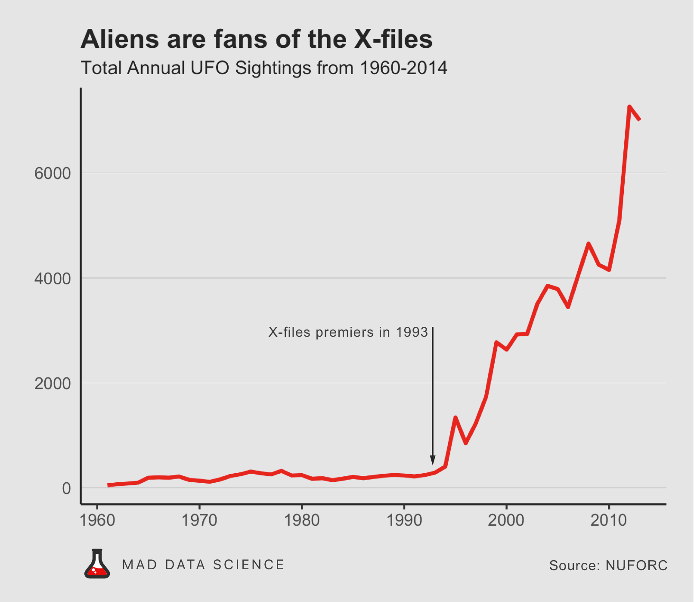
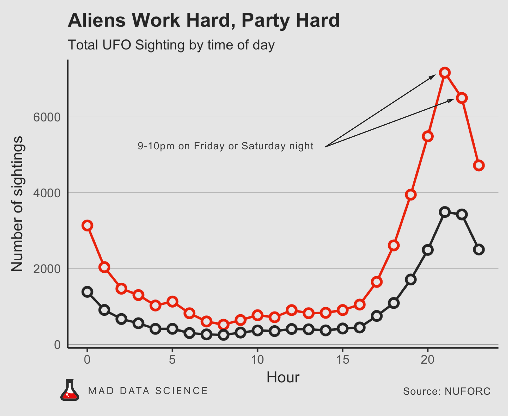

*[Daniel Henebery](http://www.questionable-economics.com/what-do-we-know-about-aliens/) and I had a lot of fun writing this article together. We are especially grateful to the National UFO Reporting Center. We're skeptics, but we still appreciate the hard work that made this possible.*

---

First, aliens exist.

This is evident from extensive anecdotal evidence supporting the existence of extra-terrestrial beings. Consider this account from Prescott, Arizona on March 19, 1997:

  > While doing astrophotography I observed five yellow-white lights in a "V" formation moving slowly from the northwest, across the sky to the northeast, then turn almost due south and continue until out of sight.... During the NW-NE transit one of the trailing lights moved up and joined the three and then dropped back to the trailing position. I estimated the three light "V" to cover about 0.5 degrees of sky and the whole group of five lights to cover about 1 degree of sky.

This detailed description is but one of over 80,000 UFO sightings that have been recorded by the [The National UFO Reporting Center (NUFORC)](http://www.nuforc.org/). According to its website, NUFORC's mission is: "to receive, record, and to the greatest degree possible, corroborate and document reports from individuals who have been witness to unusual, possibly UFO-related events." To this end, the center relies on individuals to report UFO sightings. Many individuals report directly and many more are referred to the NUFORC by the Federal Aviation Administration, the National Weather Services, NASA, and 911 emergency dispatchers.

The NUFORC maintains these reports in an [online database](http://www.nuforc.org/webreports/ndxevent.html) available for the public to download. An analysis of reported sighting density across various partitions of time reveals that certain alien preferences are curiously human.

In September 1993, the cult television show [X-Files](http://en.wikipedia.org/wiki/The_X-Files) premiered. 12 million people --about 5% of the US population at the time-- watched the premier and 27 million watched during the show's peak in 1997. It is likely that these numbers are low, as they only count human viewership.

The main storyline of the show follows the interactions between extra-terrestrials and FBI Special Agents Mulder and Scully. As a result, aliens are a natural extension of the show's target demographic. While Nielson ratings for [Kepler 438b](http://en.wikipedia.org/wiki/Kepler-438b) are not yet available, the record clearly shows a statistically significant structural-break in the number of reported sightings in 1993. Much like [Downton Abbey fans]() more and more aliens wanted to see each new season before it was made available locally.

The 24-hour day and the 7-day week only make sense on Earth. One would not necessarily expect UFO activity to follow a daily- or a weekly-pattern and yet this is exactly what one finds in the data: On any day of the week, aliens are generally out between 6 PM and midnight, and favor Friday and Saturday nights over Mondays and Tuesdays.

This schedule only makes sense if alien activity follows some human activity. Given the bias towards the evening and the weekend, one can infer that the activity that aliens are interested in occurs during human leisure time. In other words, peak-UFO activity seems to occur at the same time as peak-college-fraternity-drinking activity. This is speculative, but it could explain why UFOs that cross light years [crash as soon as they get to New Mexico](http://en.wikipedia.org/wiki/Roswell_UFO_incident)

The movie [Independence Day](http://www.imdb.com/title/tt0116629/) is slander and [Roland Emmerich](http://www.imdb.com/name/nm0000386/?ref_=tt_ov_dr) is a hack. Aliens are not bent on world domination. They love America and they celebrate the 4th of July.

Mr. Emmerich's idea of aliens is a paranoid delusion. Everyone knows extra-terrestrials come down to earth every 4th of July to see the fireworks and eat hot dogs. The chart above shows this: In any given year, aliens are more likely to visit the earth on the 4th of July than any other day. And what else besides fireworks, hotdogs, and one terrible movie is that day known for? This plus the fact that the White House is still standing, suggests aliens are just here for the party.

### What Other Truths Are Out There?
Aliens have other interests on Earth, which continued observation may help uncover. For example, the data also hints that aliens may come to earth to see the aurora borealis and the Leonid Meteor shower or even to race experimental military aircraft. More years of observation, aided by the documentation efforts of the NUFORC, are necessary to continue learning. The insight it gives into human behavior is interesting -- even to skeptics.
